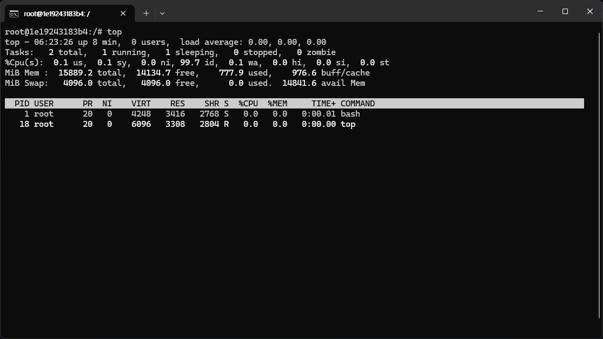

# 리눅스 명령어

## top 명령어
top 명령어는 리눅스 시스템의 cpu사용량, 메모리 사용량 등을 보여주는 명령어이다.

command 창에 다음 명령어를 치면 사용할수 있다.
```
top
```





### 참조 블로그들
https://code-lab1.tistory.com/332

https://velog.io/@ljk0509/EC2-top-%EB%AA%85%EB%A0%B9%EC%96%B4-%EC%A0%9C%EB%8C%80%EB%A1%9C-%EC%9D%B4%ED%95%B4%ED%95%98%EA%B8%B0


## ps 명령어
1. Only foreground applications are allowed to be used.
2. Debugging can be enabled via adb command.

## jobs 명령어

## kill 명령어
